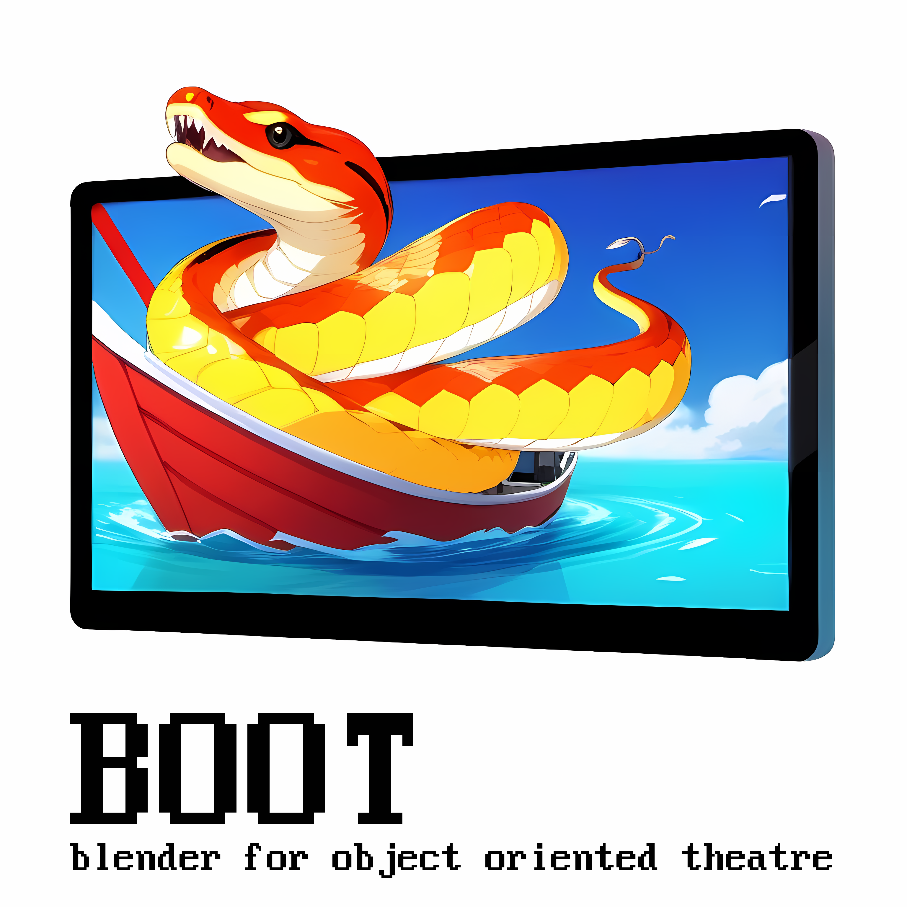

<p align="center">

<br/>
A pipeline to orchestrate physical automated object theater, using Blender
</p>

## Aim
This project enables you to plan, edit, export and perform automated object- and puppet theatre by 
creating a 1:1 virtual replica of the physical installation. You can thus benefit from having a *single source of truth*
for all aspects of the play while enjoying the flexibility and expressivity of Blender for editing arrangement, acting, 
audio and everything else. During editing you can preview the entire¹ play virtually before exporting it to the physical 
environment.

## Terminology

Missing and subject to change. 

Currently:
- *SBC* means single board embedded computer with GPIO, such as a Raspberry Pi²
- *client* refers to a SBC used for controlling *all* physical actions (movements, audio, ...)

## Config
Create a `config/config.json` locally on all devices, currently undocumented.

This file contains all environment information about the machine where Blender is used to edit scenes and the 
embedded computer (with GPIO) used to perform the final play.

## Blender setup
Copy the code from `blender-in-editor/blender-ui.py` into a script in your Blender file and execute it.  
You might need to adjust the relative path to this project at the top of the file.

### Blender scene setup: custom properties
Digital (Blender) entities are mapped to physical objects (e.g. motors) and certain functionalities 
via custom properties. To add a custom property go the *Object properties* tab, with the respective name
(as documented below for each feature) and a unique ID or a parameter as value.
Annotated objects are auto-discovered based on these properties and – if applicable – included in the export.

#### Controlling servos: `servo`
To control a physical servo based on an objects <u>1 dimensional</u> rotation, add a `servo` property with a unique ID.
The dimension is auto-discovered.

#### Generate speech movements from audio: `bake`
To generate digital movements from a recorded audio file use the `bake` property with an audio channel
(from the Sequence) as argument (value).  
This digital movement can be passed to a physical object by adding more properties to the same object.

### Scenes
The current animation range is respected and normalized, i.e. the exported scene always starts at time 0.

### Triggers
Adding text strips to the sequence allow you to trigger a variety of scriptable effects on the client.

A trigger consists of a *type*.
It is optionally followed by a colon followed by a an *expression*.
If there is an expression, it can optionally be followed by a semicolon and one or more semicolon-separated 
*expression arguments*. 
The expression arguments do not have a standardized format. 
The separators cannot be escaped.

Most triggers activate on their starting frame and have no concept of length.

Example:
```
logic:wait_for_sound;goto=keep-pressed-1
```

Currently supported types:
- `hardware:` execute arbitrary code from the client's hardware package  
  (it really is handled with `eval(f"self._hardware.{expression}")`)
- `midi:` triggers MIDI files by name (without extension)
- `marker:` marks a frame, so that it can be jumped to by name
- `logic:` triggers one of a set of predefined, hard-coded state transitions
  (such as jumping to a marked frame based on a condition, as in the above example)
- `mute` / `unmute` don't play upcoming sound files (or revert)
- `log:` print the expression to STDOUT

Unknown types result in a printed warning.

### Audio
Audio channel number and layout is currently hardcoded to 3 mono channels in the sequence exported as three stereo 
channels, organized as 8× mono in one audiofile per chunk. (Audio chunking not documented yet.)

## Workflow

- Create a Blender scene replicating your physical installation
  (or vice versa, you can use Blender to plan your installation and then build it physically later)
- Add the Blender script within the Blender UI (see above) and execute it once
- Add custom properties to some objects (see above) and keyframe their movement (if applicable)
- Add a sequence with:
  - text strips for events and transition logic
  - audio
- Hit the "Render & upload" button to transfer audio & movement to the "client" SBC
  - This step will "bake" audio-based mouth movements – use the "Render" button to bake without uploading
- Press play in your physical setup or from the Blender UI to view your *physical* play

## Limitations and outlook
Currently all physical actions must be controlled from a single SBC. 
Audio is played through a single 8-channel soundcard.
Servos are the only motor type supported.
All triggers/effects are hardcoded.

This will change in the future to a network of SBCs with one of them acting as a centralised "conductor".
Audio layout will be configurable and distributed.
Triggers and effects will be plugin based.

## Alternatives
None that I know of – if you find any please let me know!

## Notes

¹ Well, mostly. If you use logic and transitions that depend on sensors / physical circumstances or execute code 
snippets this will not hold. Stubbing is planned, but not yet implemented.   
² Consider [boycotting Raspberry Pi and using an alternative board](https://social.platypush.tech/@blacklight/109480876474810276)
